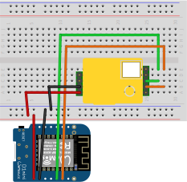

## **Projektbeschreibung**
*Dies ist der Sourcecode des Jufo-Projektes "Modern Air - Lüften neu definiert" zur Wettbewerbsrunde 2021*

### Aktuell entwickelt von:
* [Torben Heine](https://github.com/showetek)
* [Paul Paysan](https://github.com/PaulPaysan)

## **Boards**
*In unserem Projekt benutzen wir folgende Boards:*
* Arduino Uno
* LOLIN WeMos D1 R2 WiFi ESP8266
* LOLIN WeMos D1 Mini Lite

## **Libraries**
*Folgende externe Bibliotheken werden weitergehend im Code genutzt:*
* [Arduino core for ESP8266 WiFi chip](https://github.com/esp8266/Arduino)

## **Wiring**
### FanStation

>
### Sensor
>
